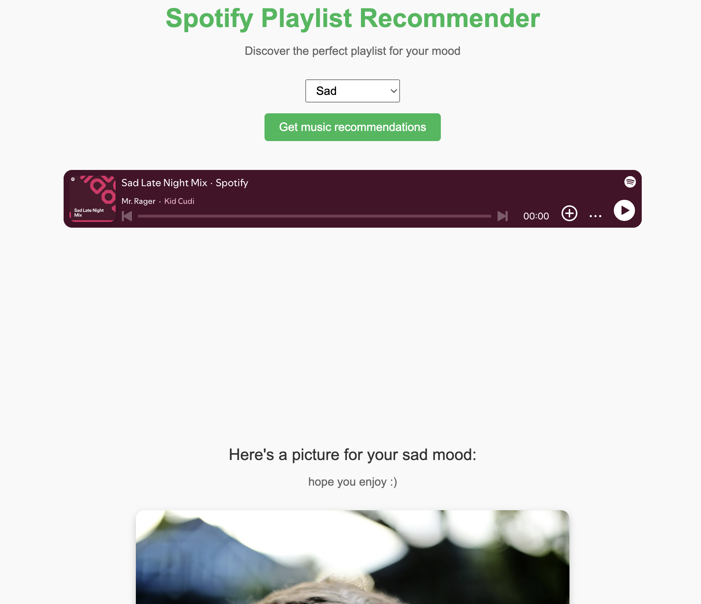
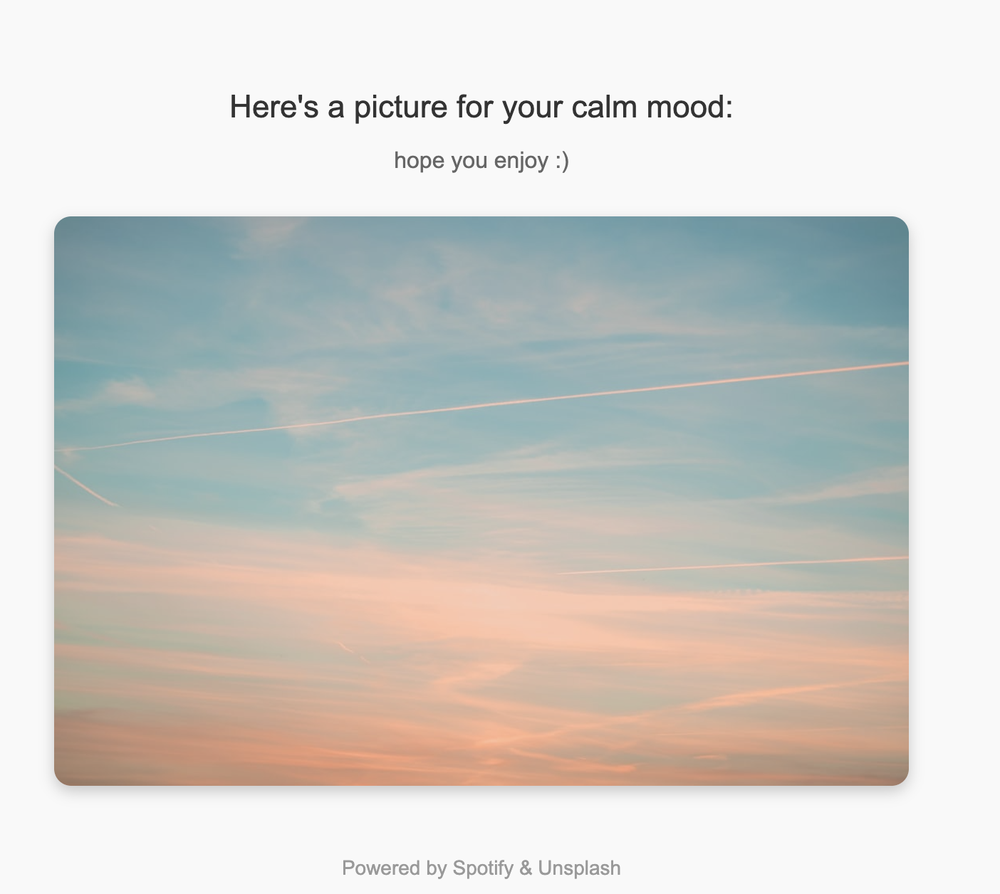

# Dali-Dev-Challenge-2025
## Author: Caleb Ash

## Description:
This application allows you to insert your mood from a list of a few options, and using your Spotify account, it gives you a playlist based on your mood, and you can even listen to it in the applicaiton! A picture based on your mood is also grabbed to accompany your music choice.

It can be found here: [Spotify Playlist Recommender](https://dali-dev-challenge-2025.onrender.com/)

## Instructions to setup locally:
1. Clone the repository into VSCode or the IDE of your choice. 
2. Setup the environment variables including the Spotify client and secret keys, unsplash client key, and a redirect URI
3. 'npm install'

## Learning Journey:
After searching through some APIs, I pretty quickly found and settled upon the Spotify API. I read through its documentation and uses, and was blown away by the amount of things you're able to do with it. After this I knew I wanted to use it as the primary API in my application. I decided to add in the pictures as a nice touch using the unsplash API and effectively searching and returning an image based on the mood selected from their API. I found this to be a nice touch and allowed for a little more calmness and empathy for whoever may use this.

The main thing I explored and learned about was the Spotify API and specifically the Spotify Web Playback SDK, and what an SDK is in general. Integrating that into my app was an exciting project, and I'm curious to see what else I can do with the Spotify API. Using the Web Playback SDK was an important technology I used. At first, I considered just returning a list of playlists that the Spotify API can return based on the mood search. While that may have been decent and allowed for more content to be outputted, I felt like having the playlist as an option to play directly within the application was important. Plus, it let me listen to music while testing it and writing this up. Probably the biggest challenge I faced was figuring out the URI and ensuring the API keys were kept secret and the app was able to access these tokens successfully. Reading the documentation was helpful to solving this, as Spotify did a very good job clearly explaining their uses and how you can approach these things.